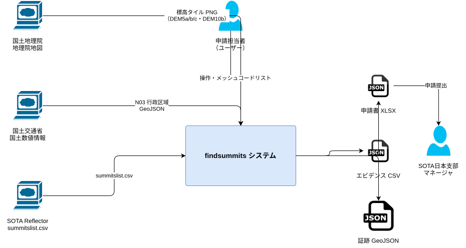
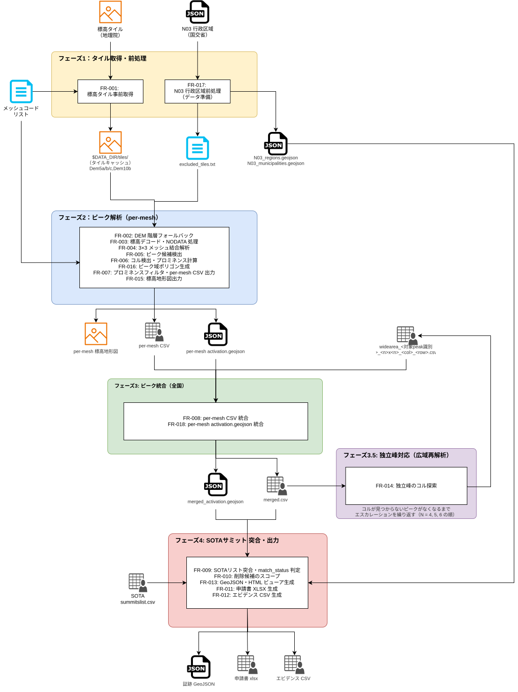

# findsummits - ソフトウェア要件仕様書 (SRS)

| 項目 | 内容 |
|---|---|
| 作成日 | 2026-04-30 |
| 最終更新日 | 2026-05-24 |
| ステータス | ドラフト（FR-002/003 フェーズ2 移動済み・3章小節化） |
| 参照 URD | [`01_URD.md`](01_URD.md) |

---

## 目次

1. [目的・範囲](#1-目的範囲)
2. [用語定義](#2-用語定義)
3. [システムアーキテクチャ概要](#3-システムアーキテクチャ概要)
   - [3.1 システムコンテキスト](#31-システムコンテキスト)
   - [3.2 主要コンポーネント構成](#32-主要コンポーネント構成)
   - [3.3 フェーズ分割の俯瞰](#33-フェーズ分割の俯瞰)
4. [機能要件](#4-機能要件)
   - [フェーズ1: タイル取得・前処理](#フェーズ1-タイル取得前処理)
     - [FR-017: N03 行政区域前処理（データ準備）](#fr-017-n03-行政区域前処理データ準備)
     - [FR-001: 標高タイル事前取得](#fr-001-標高タイル事前取得)
   - [フェーズ2: ピーク解析（per-mesh）](#フェーズ2-ピーク解析per-mesh)
     - [FR-002: DEM 階層フォールバック](#fr-002-dem-階層フォールバック)
     - [FR-003: 標高デコード・NODATA 処理](#fr-003-標高デコードnodata-処理)
     - [FR-004: 3×3 メッシュ結合解析](#fr-004-33-メッシュ結合解析)
     - [FR-005: ピーク候補検出](#fr-005-ピーク候補検出)
     - [FR-006: コル検出・プロミネンス計算](#fr-006-コル検出プロミネンス計算)
     - [FR-016: ピーク域ポリゴン生成](#fr-016-ピーク域ポリゴン生成)
     - [FR-007: プロミネンスフィルタ・per-mesh CSV 出力](#fr-007-プロミネンスフィルタper-mesh-csv-出力)
     - [FR-015: 標高地形図出力](#fr-015-標高地形図出力)
   - [フェーズ3: ピーク統合（全国）](#フェーズ3-ピーク統合全国)
     - [FR-008: per-mesh CSV 統合](#fr-008-per-mesh-csv-統合)
     - [FR-018: per-mesh activation.geojson 統合](#fr-018-per-mesh-activationgeojson-統合)
   - [フェーズ3.5: 独立峰対応（広域再解析）](#フェーズ35-独立峰対応広域再解析)
     - [FR-014: 独立峰のコル探索](#fr-014-独立峰のコル探索)
   - [フェーズ4: SOTAサミット 突合・出力](#フェーズ4-sotaサミット-突合出力)
     - [FR-009: SOTAリスト突合・match_status 判定](#fr-009-sotaリスト突合match_status-判定)
     - [FR-010: 削除候補のスコープ](#fr-010-削除候補のスコープ)
     - [FR-013: GeoJSON・HTML ビューア生成](#fr-013-geojsonhtml-ビューア生成)
     - [FR-011: 申請書 XLSX 生成](#fr-011-申請書-xlsx-生成)
     - [FR-012: エビデンス CSV 生成](#fr-012-エビデンス-csv-生成)
5. [非機能要件](#5-非機能要件)
   - [NFR-001: 精度（プロミネンス判定）](#nfr-001-精度プロミネンス判定)
   - [NFR-002: メモリ使用量](#nfr-002-メモリ使用量)
   - [NFR-003: 再現性（決定論的出力）](#nfr-003-再現性決定論的出力)
   - [NFR-004: アクセスマナー](#nfr-004-アクセスマナー)
   - [NFR-005: 処理時間目標](#nfr-005-処理時間目標)
   - [NFR-006: 可搬性・環境](#nfr-006-可搬性環境)
   - [NFR-007: ログ出力](#nfr-007-ログ出力)
   - [NFR-008: UI レスポンス](#nfr-008-ui-レスポンス)
6. [外部インターフェース仕様](#6-外部インターフェース仕様)
   - [6.1 入力: 地理院標高タイル](#61-入力-地理院標高タイル)
   - [6.2 入力: SOTA サミットリスト CSV](#62-入力-sota-サミットリスト-csv)
   - [6.3 出力: 申請書 XLSX](#63-出力-申請書-xlsx)
   - [6.4 出力: エビデンス CSV](#64-出力-エビデンス-csv)
   - [6.5 出力: GeoJSON・HTML ビューア](#65-出力-geojsonhtml-ビューア)
   - [6.6 中間ファイル: メッシュ別ピーク候補 CSV](#66-中間ファイル-メッシュ別ピーク候補-csv)
   - [6.7 出力: 標高地形図（Terrain-RGB PNG）](#67-出力-標高地形図terrain-rgb-png)
   - [6.8 中間ファイル: メッシュ別ピーク域 GeoJSON](#68-中間ファイル-メッシュ別ピーク域-geojson)
   - [6.9 入力: N03 前処理済みファイル（FR-017 生成）](#69-入力-n03-前処理済みファイルfr-017-生成)
   - [6.10 入力: SOTA 既存サミット GeoJSON（geojson_v{N}）](#610-入力-sota-既存サミット-geojsongeojson_vn)
   - [6.11 中間ファイル: 全国統合済みピーク域 GeoJSON](#611-中間ファイル-全国統合済みピーク域-geojson)
   - [6.12 出力: 公開用 HTML（閲覧専用・ブラウザダウンロード）](#612-出力-公開用-html閲覧専用ブラウザダウンロード)
7. [外部システム依存関係・環境](#7-外部システム依存関係環境)
8. [制約・前提条件](#8-制約前提条件)
9. [スコープ外](#9-スコープ外)

---

## 1. 目的・範囲

本文書は [`01_URD.md`](01_URD.md) に定めるユーザー要件（UR-001〜UR-010）を実現するための
ソフトウェア要件を規定する。

**対象システム**: findsummits（解析エンジン + Python スクリプト群）  
**対象バージョン**: 1.0（予定）  
**対象外**: 実装詳細（HLD/LLD）、テスト仕様（UT/IT/ST）

---

## 2. 用語定義

[`00_GLOSSARY.md`](00_GLOSSARY.md) を参照。

---

## 3. システムアーキテクチャ概要

### 3.1 システムコンテキスト



本システムは以下の外部要素と接続する。

- **外部データソース**
  - 国土地理院 標高タイル（DEM5a/5b/5c/DEM10b、ズームレベル15 PNG）
  - 国土交通省 国土数値情報 N03 行政区域 GeoJSON
  - SOTA Reflector summitslist.csv
- **外部アクター**
  - 申請担当者（ユーザー）— データ取得・解析実行・申請書確認
  - SOTA 日本支部マネージャ — 申請書受領・審査
- **外部成果物（本システムの最終出力）**
  - 申請書 XLSX（SOTA 日本支部提出用）
  - エビデンス CSV
  - 証跡 GeoJSON

### 3.2 主要コンポーネント構成

各コンポーネントの責務と主要 I/O を論理的に定義する。実装言語・実装ファイル名の決定は ADR に委ねる（[ADR-001](decisions/ADR-001-hybrid-c-python-architecture.md)、[ADR-010](decisions/ADR-010-cpp-opencv-migration.md) 参照）。

| コンポーネント | 責務 | 主要入力 | 主要出力 |
|---|---|---|---|
| タイル取得コンポーネント | DEM タイルを国土地理院から取得・キャッシュ | メッシュコード、取得設定 | キャッシュ済み PNG タイル |
| 行政区域前処理コンポーネント | 都道府県・振興局境界 GeoJSON を解析用形式に変換（初回のみ） | N03 行政区域 GeoJSON | 軽量化された境界 GeoJSON |
| 地形解析エンジン | DEM からピーク／コル／プロミネンス／AZ・delete判定ゾーンを検出 | キャッシュ済み PNG タイル | 処理モードにより異なる（通常モード: per-mesh CSV / per-mesh activation GeoJSON / 標高地形図 PNG、広域モード: per-mesh CSV のみ） |
| 統合・突合コンポーネント | per-mesh 成果物を統合し SOTA リストと突合、不備フラグ判定・exit code 制御 | per-mesh CSV／GeoJSON、SOTA リスト CSV、境界 GeoJSON | merged.csv、merged_activation.geojson |
| 可視化生成コンポーネント | 統合結果から可視化 GeoJSON と HTML ビューアを生成 | merged.csv、merged_activation.geojson | merged.geojson、merged_viewer.html |
| 申請書生成 UI | HTML ビューア内でユーザー操作に応じて申請書 XLSX を生成 | ユーザー操作（HTML ビューア上） | 申請用 XLSX |

### 3.3 フェーズ分割の俯瞰



3ステップの運用フローで使用する。

```
【ステップ1: データ取得・前処理】
タイル取得コンポーネント              タイル事前取得（フェーズ1）
行政区域前処理コンポーネント           N03 行政区域前処理（フェーズ1・初回のみ）
       └─ $DATA_DIR/ref/N03-{n03_year}_regions.geojson  ← 統合・突合コンポーネントが参照
       ↓
【ステップ2: 解析・突合・確認】（GeoJSON/HTML で結果を確認してから次ステップへ）
地形解析エンジン         ピーク・コル検出・ピーク域ポリゴン生成（フェーズ2）
       ├─ per-mesh CSV              ($DATA_DIR/results/csv/<meshcode>.csv)
       ├─ per-peak polygons         ($DATA_DIR/results/csv/<meshcode>_activation.geojson)
       └─ 標高地形図                ($DATA_DIR/images/<meshcode>_terrain.png)
統合・突合コンポーネント   統合・突合・出力生成（フェーズ3〜4）
       ├─ merged.csv                ($DATA_DIR/results/merged.csv)    ← エビデンス CSV
       └─ merged_activation.geojson ($DATA_DIR/results/merged_activation.geojson)
可視化生成コンポーネント   GeoJSON・HTML ビューア生成（フェーズ4）
       ├─ merged.geojson            ($DATA_DIR/results/merged.geojson) ← 証跡 GeoJSON
       └─ merged_viewer.html ← HTML ビューア（GeoJSON 埋め込み・申請書 XLSX エクスポート機能付き）
【ステップ3: 申請書生成】（HTML ビューアで内容確認後、申請書エクスポートボタンで XLSX 生成）
```

---

## 4. 機能要件

### フェーズ1: タイル取得・前処理

#### FR-017: N03 行政区域前処理（データ準備）

- **対応 UR**: [UR-001](01_URD.md#ur-001), [UR-003](01_URD.md#ur-003), [UR-004](01_URD.md#ur-004)
- 国土数値情報の市区町村単位の行政区域データを前処理する初回のみ実行するスクリプト（`preprocess_pref_boundaries.py`）
- **実行タイミング**: 初回のみ（突合処理の前に一度だけ実行する）
- **入力**: `$DATA_DIR/ref/N03-{n03_year}.geojson`（国土数値情報 N03-{n03_year} 全国行政区域データ。ユーザーが事前にダウンロードして配置する。`{n03_year}` は `params/config.ini` の `n03_year` パラメータで指定）
- **出力**（3種）:
  1. `$DATA_DIR/ref/N03-{n03_year}_regions.geojson` — 都道府県/振興局単位（47都道府県 + 北海道14振興局 = 計61地域）。FR-009 での SOTA エリアコード自動付与に使用
  2. `$DATA_DIR/ref/N03-{n03_year}_municipalities.geojson` — 市区町村単位（約2,000地域）。FR-009 での所在地（市区町村名）取得に使用
  3. `$DATA_DIR/ref/N03-{n03_year}_excluded_tiles.txt` — 北方領土6村（市区町村コード 01696〜01701）に該当するポリゴン内のズームレベル15タイル座標リスト（x y 形式、1行1タイル）。判定基準: タイルの中心点が対象ポリゴン内に含まれるタイルを列挙する（詳細: [`decisions/ADR-005-northern-territories-exclusion.md`](decisions/ADR-005-northern-territories-exclusion.md)）。FR-003 での NODATA マスクに使用
- **北方領土の識別**: N03 の行政区域コード属性（N03_007）が 01696〜01701 に一致するポリゴンを除外対象として識別する（詳細: [`decisions/ADR-005-northern-territories-exclusion.md`](decisions/ADR-005-northern-territories-exclusion.md)）
- **フォールバック**: 前処理済みファイルが存在しない場合、北方領土タイル除外（FR-003）をスキップして警告ログを出力し、地域不明を示す仮サミットコード（`ZZ/ZZ-A01` 形式）を付与して処理を続行する（処理は停止しない）。仮サミットコードの採番ロジックは [FR-009 参照](#fr-009-sotaリスト突合match_status-判定)
- 出典: [`ref/SOURCES.md`](../ref/SOURCES.md)（国土数値情報 N03 行政区域）

#### FR-001: 標高タイル事前取得

- **対応 UR**: [UR-001](01_URD.md#ur-001), [UR-010](01_URD.md#ur-010)
- **入力**: メッシュコードリストファイル（解析対象の1次メッシュコードを1行1件で列挙したファイル。`params/mesh_list_japan.txt` が標準）
- 国土地理院の標高タイル（ズームレベル15、256×256px PNG）を `$DATA_DIR/tiles/` に取得・キャッシュする
- 各メッシュコードについて、[メッシュコード → 緯度経度変換](00_GLOSSARY.md#mesh-to-latlon)の計算式でそのメッシュの四隅の緯度経度を求め、[緯度経度 → XYZ タイル番号変換](00_GLOSSARY.md#latlon-to-tile)の計算式から取得対象のタイル番号範囲を特定する
- **取得範囲**: メッシュコードリストの各メッシュコードについて、そのメッシュをカバーする最小範囲の標高タイルを取得する（隣接メッシュへの拡張は行わない。全176メッシュを一括取得する運用では、メッシュ境界付近のタイルが複数メッシュから重複して取得されるが問題ない）
- DEM 種別ごとに次のディレクトリ階層で保存する: `$DATA_DIR/tiles/{z}/{x}/{y}_{dem}.png`（`{dem}` は DEM 種別の最後1桁: `a`=DEM5a、`b`=DEM5b/DEM10b、`c`=DEM5c。DEM5b と DEM10b はズームレベル（z=15/14）で区別）
- キャッシュ済みタイルの再取得時は `If-Modified-Since` ヘッダーを付与してリクエストし、サーバー側に更新がない場合（HTTP 304）はダウンロードをスキップする
- サーバーから「リクエスト過多（HTTP 429）」または「一時利用不可（HTTP 503）」が返された場合、待機時間を倍々に増やしながら（エクスポネンシャルバックオフ）リトライする
- タイル取得の HTTP リクエストに、ツール名と連絡先メールアドレスを含む識別子（User-Agent: `findsummits/1.0 (mailto:<メールアドレス>)`）を付与する（地理院サーバー側でアクセス元を特定・問い合わせできるようにするため）。メールアドレスはパラメータファイルに記入する（詳細は HLD 参照）
- リクエスト間隔はパラメータファイルで設定する（詳細は HLD 参照）
- タイルを並列で取得する（並列数はパラメータファイルで設定する、既定値: 4）
- DEM5a / DEM5b / DEM5c / DEM10b の全種別を取得対象とし、地理院側未整備のタイル（HTTP 404）はスキップする。各 DEM 種別の利用優先順位は [FR-002](#fr-002-dem-階層フォールバック) を参照

---

### フェーズ2: ピーク解析（per-mesh）

#### FR-002: DEM 階層フォールバック

- **対応 UR**: [UR-001](01_URD.md#ur-001)
- **適用タイミング**: タイル読み込み時にピクセル単位で実行する（タイル取得段階での DEM 種別決定とは別概念）
- 標高データの利用優先順位は DEM5a → DEM5b → DEM5c → DEM10b の順とする
- DEM5a/5b/5c は 5m 解像度、DEM10b は 10m 解像度。DEM10b のデータは 2×2 ピクセルに拡大して DEM5 と同じグリッドに合わせて使用する
- 上位 DEM のピクセルが無効値（-9999m）または該当タイルが存在しない場合、同座標の次の DEM 種別のピクセル値を使用する
- 詳細は [`decisions/ADR-002-dem-hierarchy-fallback.md`](decisions/ADR-002-dem-hierarchy-fallback.md) を参照

#### FR-003: 標高デコード・NODATA 処理

- **対応 UR**: [UR-001](01_URD.md#ur-001)
- 標高タイルは PNG 画像形式で配信されており、各ピクセルの RGB 値から標高（m）を計算する: `標高 = (R×65536 + G×256 + B) / 100.0`
- 標高値なし（海・データ未整備等）を示すピクセル（R=128, G=0, B=0）は無効値（-9999m）として扱う
- 無効値のピクセルはピーク検出・プロミネンス計算の対象から除外する
- **北方領土タイル除外**: タイル読み込み時に `$DATA_DIR/ref/N03-{n03_year}_excluded_tiles.txt`（FR-017 生成）を参照し、リスト内のタイル（ズームレベル15の x/y 座標）は全ピクセルを無効値（-9999m）として扱う。ファイル未存在時の動作は [FR-017 参照](#fr-017-n03-行政区域前処理データ準備)（詳細: [`decisions/ADR-005-northern-territories-exclusion.md`](decisions/ADR-005-northern-territories-exclusion.md)）
- **竹島の除外**: 竹島が含まれるメッシュ 5531 を `params/mesh_list_japan.txt` から除外することで対応する。N03 ポリゴンベースのタイルマスク（北方領土と同方式）は使用しない。FR-003 での追加処理はない（詳細: [`decisions/ADR-009-takeshima-exclusion.md`](decisions/ADR-009-takeshima-exclusion.md)）
- **マイナス標高の扱い**: デコード式の中間値 x（符号なし 24bit）が 0x800000（= 2^23）より大きい場合は `x - 2^24` を適用して符号付き整数に変換し、100 で除算する。これにより干拓地など海面下ピクセルは負の標高値としてデコードされる。ただしデコード完了後のタイル処理段階で、負値は無効値（-9999m）と同様に海面高度（`ELEV_SEA = 0.0m`）に統一される。この時点で「本来の海面（0m）」「NODATA」「負の標高」は区別されなくなり、いずれもピーク検出・プロミネンス計算の対象から除外される

#### FR-004: 3×3 メッシュ結合解析

- **対応 UR**: [UR-001](01_URD.md#ur-001), [UR-007](01_URD.md#ur-007)
- **入力**: メッシュコードリストファイル（[FR-001](#fr-001-標高タイル取得) と同じファイル）
- メッシュコードリストをコード昇順にソートしてから、1 メッシュずつ順番に解析する
- 解析対象メッシュの決定: 処理中のメッシュコード `aabb` に対し、`(aa-1)〜(aa+1)` × `(bb-1)〜(bb+1)` の最大 9 メッシュのうち、メッシュコードリストに存在するものを解析対象とする
- 解析対象メッシュ全体の四隅の緯度経度を求め（[メッシュコード → 緯度経度変換](00_GLOSSARY.md#mesh-to-latlon) 参照）、その緯度経度をもとに標高タイル（ズームレベル 15）のタイル番号を特定する（[緯度経度 → XYZ タイル番号変換](00_GLOSSARY.md#latlon-to-tile) 参照）
- 特定したタイルを 1 枚の画像に結合する。タイルとメッシュの境界は一致しないため、結合画像はメッシュ境界より数十 m はみ出す
- 結合範囲の外周に 1px 幅の海面ボーダー（0m）を付加し、メッシュ端を海岸線とみなす
- 解析対象メッシュ全体の地理的範囲内のピークを per-mesh CSV に出力する
- 全176メッシュを逐次実行すると、同一ピークが複数の解析（最大9回）に含まれる。フェーズ3 の重複排除後に `analysis_count`（実際の解析回数）と `expected_count`（期待解析回数）で安定性を評価する（[FR-009 参照](#fr-009-sotaリスト突合match_status-判定)）
- **処理モードパラメータ**（通常モード／広域モード）:
  - **通常モード**: メッシュ数 N=3、ズームレベル L=15。本 FR の標準動作。出力 per-mesh CSV/GeoJSON のファイル名は `<meshcode>.csv` / `<meshcode>_activation.geojson`
  - **広域モード**: メッシュ数 N=4/5/6、ズームレベル L=14。[FR-014](#fr-014-独立峰のコル探索) から「対象ピーク + N×N メッシュコードリスト」を指定して呼び出される。タイル結合時に 2×2 ピクセル max pooling でレベル 14 化する（別途タイル取得不要）。広域モードの出力 per-mesh CSV/GeoJSON は通常モードと区別できるファイル名で出力する（詳細は [FR-014](#fr-014-独立峰のコル探索) 参照）
  - 解析・ピーク検出・コル検出のロジック自体は通常モードと共通（[FR-005](#fr-005-ピーク候補検出)・[FR-006](#fr-006-コル検出プロミネンス計算)・[FR-007](#fr-007-プロミネンスフィルタper-mesh-csv-出力)）。広域モードは入力パラメータのみが異なる。広域モードは [FR-016](#fr-016-ピーク域ポリゴン生成) のポリゴン生成を呼び出さない（詳細は [FR-014](#fr-014-独立峰のコル探索) 参照）
- 詳細は [`decisions/ADR-003-3x3-mesh-analysis.md`](decisions/ADR-003-3x3-mesh-analysis.md) を参照

#### FR-005: ピーク候補検出

- **対応 UR**: [UR-001](01_URD.md#ur-001), [UR-002](01_URD.md#ur-002)
- 全ピクセルを標高降順にソートし、高い順に 1 ピクセルずつ処理する
- 処理中のピクセルの 8 近傍に処理済みピクセルが 1 つもない場合、そのピクセルが新しい山塊グループの頂点（ピーク候補）となる
- 処理済み隣接が 1 グループの場合はそのグループに合流し、2 グループ以上の場合はコル（[FR-006 参照](#fr-006-コル検出プロミネンス計算)）として各グループを統合する
- Union-Find（連結成分管理アルゴリズム）でグループを管理する

#### FR-006: コル検出・プロミネンス計算

- **対応 UR**: [UR-002](01_URD.md#ur-002), [UR-005](01_URD.md#ur-005)
- 各ピークに対してプロミネンスを規定するコルを検出する
- [FR-005](#fr-005-ピーク候補検出) の処理中に 2 つ以上の山塊グループが初めて接触した時点のピクセルがコルであり、その標高がコル標高となる
- プロミネンス = ピーク標高 − コル標高
- コルが解析範囲外の場合、プロミネンスは暫定値とし、per-mesh CSV に `key_col_resolved=false` を付与する（[FR-014 参照](#fr-014-独立峰のコル探索)）

#### FR-016: ピーク域ポリゴン生成

- **対応 UR**: [UR-003](01_URD.md#ur-003), [UR-006](01_URD.md#ur-006)
- ピーク候補検出・プロミネンス計算（[FR-005](#fr-005-ピーク候補検出)・[FR-006](#fr-006-コル検出プロミネンス計算)）完了後に、各ピークについて以下の2種類のポリゴンを GeoJSON として生成する
- **共通仕様**:
  - **計算方法**: ピーク位置を起点として Flood Fill（隣接ピクセルを再帰的に広げる領域塗りつぶし）を実行し、条件を満たす連続ピクセルを抽出する。ピクセル群の外周輪郭を GeoJSON Polygon として出力する
  - **出力は lossless とする**: [FR-009](#fr-009-sota-リスト突合) の point-in-polygon 突合精度を確保するため、形状を変える簡略化（Douglas-Peucker 等）や等間隔での頂点間引きは行わない。直線上にある冗長な中間頂点の削除（ピクセル境界トレース結果で連続する collinear 点の除去）は形状を変えないため可とする
  - Flood Fill が解析対象メッシュ全体の地理的範囲内で完結している場合 `area_complete=true`、解析範囲外で途切れた場合 `area_complete=false` を付与する（false の場合、ポリゴンが実際より小さく計算されている可能性を示す）。同一ピークは複数の 3×3 メッシュ解析（中心メッシュ・隣接メッシュ）にまたがって検出されるため、[FR-018](#fr-018-per-mesh-activationgeojson-統合) で複数の per-mesh GeoJSON を統合する段階で `area_complete=true` のレコードが必ず見つかる想定（AZ は 25m 標高差以内、delete判定ゾーンは `delete_zone_max_drop` 上限キャップにより、いずれかの 3×3 解析で完結する。[ADR-011](decisions/ADR-011-delete-zone-polygon.md)）。FR-018 統合後も `area_complete=true` が見つからなかった場合は [FR-009](#fr-009-sotaリスト突合match_status-判定) の `is_area_incomplete` 不備フラグが true となり、後続処理を停止する
- **アクティベーションゾーンポリゴン**（`feature_type="activation_zone"`）:
  - **定義**: SOTA ルールに従い、ピークから標高差 25m 以内の連続エリア
  - **Flood Fill 閾値**: `peak_elev - 25.0m` 以上
  - **area_complete の扱い**: 共通仕様の通り。標高差 25m 以内のため、いずれかの 3×3 解析で必ず完結する想定
- **delete判定ゾーンポリゴン**（`feature_type="delete_zone"`）:
  - **定義**: 既存 SOTA サミットの削除判定に使用する。ピーク標高から `min(prominence, delete_zone_max_drop)` 以内の連続エリア（[ADR-011](decisions/ADR-011-delete-zone-polygon.md)）
  - **Flood Fill 閾値**: `max(col_elev, peak_elev - delete_zone_max_drop)` 以上。`key_col_resolved=false`（`col_elev` 未確定）のピークでは `peak_elev - delete_zone_max_drop` を閾値として使用する（`delete_zone_max_drop` 上限キャップによりプロミネンス不明でもポリゴン生成が可能）
  - **パラメータ**: `delete_zone_max_drop` は `params/config.ini` で管理（値 250m、実測による確定値。詳細は [ADR-011](decisions/ADR-011-delete-zone-polygon.md)）
  - **area_complete の扱い**: 共通仕様の通り。`delete_zone_max_drop` 上限キャップにより、いずれかの 3×3 解析で必ず完結する想定
- 出力先: `$DATA_DIR/results/csv/<meshcode>_activation.geojson`（2種類のポリゴンを同一ファイルに収録）
- 詳細は [6.8 中間ファイル: メッシュ別ピーク域 GeoJSON](#68-中間ファイル-メッシュ別ピーク域-geojson) を参照

#### FR-007: プロミネンスフィルタ・per-mesh CSV 出力

- **対応 UR**: [UR-001](01_URD.md#ur-001), [UR-005](01_URD.md#ur-005)
- フェーズ2 で検出したピーク候補とコルの情報を per-mesh CSV として出力する。フェーズ3（[FR-008](#fr-008-per-mesh-csv-統合)）での最終判定（プロミネンス ≥ 150m）に備えて、一次フィルタとしてプロミネンス ≥ 130m を超えたピーク候補のみを出力する
- 一次フィルタ: プロミネンス ≥ 130m（最終判定はフェーズ3 で 150m）
- 出力先: `$DATA_DIR/results/csv/<meshcode>.csv`
- **出力カラム**（ヘッダー行あり）:

| カラム | 型 | 精度 | 説明 |
|---|---|---|---|
| peak_lat | float | 小数点8桁 | ピーク緯度 |
| peak_lon | float | 小数点8桁 | ピーク経度 |
| peak_elev | float | 小数点2桁 | ピーク標高（m） |
| points | int | — | 標高バンドに基づくポイント数（1/2/4/6/8/10）。`peak_elev` を切り捨て（floor）した整数 m でバンド判定（[GLOSSARY 参照](00_GLOSSARY.md#標高バンドpoints-算出表)） |
| col_lat | float | 小数点8桁 | コル緯度（`key_col_resolved=false` の場合は 0.0） |
| col_lon | float | 小数点8桁 | コル経度（`key_col_resolved=false` の場合は 0.0） |
| col_elev | float | 小数点2桁 | コル標高（m） |
| prominence | float | 小数点2桁 | プロミネンス（m） |
| key_col_resolved | bool | true/false | コルが解析範囲内で確定済みの場合 true、解析範囲外で未発見の場合 false |
| col_margin_px | int | — | コルから解析範囲（結合画像）の端（4辺）までの最短距離（ピクセル単位）。小さいほど信頼性が低い |
| center_mesh | int | — | 解析中心メッシュコード（4桁） |

#### FR-015: 標高地形図出力

- **対応 UR**: [UR-001](01_URD.md#ur-001)（解析結果の目視確認補助）
- 解析対象の標高タイルを全て読み込んだ後、解析処理（ピーク検出・プロミネンス計算）を開始する前に標高地形図（`$DATA_DIR/images/<meshcode>_terrain.png`）を生成する（解析中に標高タイルの読み込み結果を目視確認できるようにするため）
- 出力形式: PNG（人間が視認しやすい配色で標高を色分けしたイメージ）
- 解像度: 長辺 6000px に縮小（アスペクト比保持、最近傍サンプリング）（参照: [ADR-012](decisions/ADR-012-terrain-image-downscaling-method.md)）
- NODATA は識別可能な色で表示する
- `$DATA_DIR/images/` ディレクトリが存在しない場合は自動生成する
- 詳細は [6.7 出力: 標高地形図](#67-出力-標高地形図terrain-rgb-png) を参照

---

### フェーズ3: ピーク統合（全国）

#### FR-008: per-mesh CSV 統合

- **対応 UR**: [UR-003](01_URD.md#ur-003)
- **入力**: `$DATA_DIR/results/csv/` 配下の per-mesh CSV。メッシュコードリストが指定された場合はそのメッシュの CSV のみ読み込む（省略時は全 CSV）
  - **通常モード（フェーズ2）の per-mesh CSV** と **広域モード（[FR-014](#fr-014-独立峰のコル探索) から生成）の per-mesh CSV** が同一ディレクトリ配下に混在することがある。両方を読み込み、同一ピーク座標で重複排除する
- 同一ピーク座標（ズームレベル15 タイル座標が一致）のレコードを同一ピークとして重複排除し、統合する
  - 複数解析のうち `(key_col_resolved=true, コル標高が最も高い)` レコードを代表に採用する（保守的評価）
  - 通常 per-mesh では `key_col_resolved=false` だったピークも、広域 per-mesh で `key_col_resolved=true` の結果が得られていれば、本ロジックにより広域モード結果が自動的に代表として採用される
  - `analysis_count`: 重複排除前の出現回数（実際の解析回数）
  - `expected_count`: メッシュコードリスト（オプション）をもとに算出する期待解析回数。リストが省略された場合は空欄
  - `stability`: `key_col_resolved=false` が 1 件でも含まれるか、`analysis_count ≠ expected_count` の場合 `unstable`、それ以外は `confirmed`
- プロミネンス最終フィルタ: ≥ 150m（FR-007 の 130m フィルタ通過済みのレコードに適用）
- **再入可能性**: 本機能は FR-014 のループから複数回呼び出され、その都度 merged.csv が再生成される

#### FR-018: per-mesh activation.geojson 統合

- **対応 UR**: [UR-003](01_URD.md#ur-003), [UR-006](01_URD.md#ur-006)
- **入力**: `$DATA_DIR/results/csv/` 配下の per-mesh `*_activation.geojson`。メッシュコードリストが指定された場合はそのメッシュの GeoJSON のみ読み込む（省略時は全 GeoJSON）
- 通常 per-mesh の `<meshcode>_activation.geojson`（[FR-016](#fr-016-ピーク域ポリゴン生成) 出力）のみを統合対象とする。広域モード（[FR-014](#fr-014-独立峰のコル探索)）は GeoJSON を生成しないため、広域 per-mesh ファイルは本機能の入力に含まれない
- 同一ピーク座標（ズームレベル15 タイル座標が一致）の Polygon のうち、`area_complete=true`（完全なポリゴン）のものを採用する
- `area_complete=true` がどこにも存在しない場合は [FR-009](#fr-009-sotaリスト突合match_status-判定) の `is_area_incomplete` 不備フラグが true となり、後続の [FR-013](#fr-013-geojsonhtml-ビューア生成)（GeoJSON/HTML 生成）は実施されない（[ADR-011](decisions/ADR-011-delete-zone-polygon.md)）
- delete判定ゾーンポリゴン（`feature_type="delete_zone"`）も同様に統合する。同一ピーク座標で複数ある場合は activation zone と同じ方針（`area_complete=true` のものを採用）で処理する
- 出力先: `$DATA_DIR/results/merged_activation.geojson`
- **再入可能性**: FR-014 のループ中は再入しない。広域モードは GeoJSON を生成しないため、本機能は FR-014 以前の1回のみ実行される

---

### フェーズ3.5: 独立峰対応（広域再解析）

フェーズ3 の統合結果（`merged.csv`）で `key_col_resolved=false` が残ったピークを対象に、per-mesh 解析エンジンを
広域モード（[FR-004](#fr-004-33-メッシュ結合解析) の N×N + L14 パラメータ）で再呼び出しし、
Key コルを特定する。生成された広域 per-mesh CSV は通常 per-mesh CSV とともに
[FR-008](#fr-008-per-mesh-csv-統合) に再投入され、`merged.csv` の `key_col_resolved` ・`col_elev` ・`prominence` が更新される。
N=4 で解消しなければ N=5、N=6 とエスカレーションする（縮小版パイプラインのループ）。
広域モードでは [FR-016](#fr-016-ピーク域ポリゴン生成) のポリゴン生成は実行しない（広域再解析の目的は Key コル特定のみであり、ポリゴンは通常 per-mesh の結果を使用する。[ADR-011](decisions/ADR-011-delete-zone-polygon.md)）。
アクティベーションゾーンポリゴン・delete判定ゾーンポリゴンは通常 per-mesh で常に 3×3 内で完結する想定のため、`area_complete=false` は広域再解析のトリガー対象外とする。

#### FR-014: 独立峰のコル探索

- **対応 UR**: [UR-007](01_URD.md#ur-007)
- **配置**: フェーズ3.5（フェーズ3 統合の直後、フェーズ4 突合の直前）
- **入力**: [FR-008](#fr-008-per-mesh-csv-統合) 出力 `$DATA_DIR/results/merged.csv`
- **再解析トリガー**: `merged.csv` の各ピークのうち `key_col_resolved=false`（コルが通常 per-mesh 3×3 解析範囲外 → プロミネンス未確定）のピークを対象とする
  - アクティベーションゾーン・delete判定ゾーンの `area_complete=false` はトリガー対象外（通常 per-mesh で 3×3 内に完結する想定であり、想定外発生時は [FR-009](#fr-009-sotaリスト突合match_status-判定) の `is_area_incomplete` 不備フラグで処理停止。[ADR-011](decisions/ADR-011-delete-zone-polygon.md)）
- **基本フロー（縮小版パイプラインのループ）**:
  1. **対象ピーク特定**: 上記トリガー条件で `merged.csv` から対象ピークを抽出する
  2. **エスカレーション・ループ（N = 4, 5, 6 の順）**:
     - 各対象ピークの緯度経度から、ピークが属するメッシュコードを算出
     - そのメッシュコードを含む N×N メッシュコードリストを生成（対象メッシュの位置は (1,1)〜(N,N) の N² 通り。後述の全パターン探索で順に試す）
     - **[FR-004](#fr-004-33-メッシュ結合解析) を「処理モード = N×N + L14」パラメータ付きで呼び出す**。per-mesh パイプライン（FR-004→[FR-005](#fr-005-ピーク候補検出)→[FR-006](#fr-006-コル検出プロミネンス計算)→[FR-007](#fr-007-プロミネンスフィルタper-mesh-csv-出力)）が広域モードで実行され、広域 per-mesh CSV が出力される（[FR-016](#fr-016-ピーク域ポリゴン生成) のポリゴン生成は実行しない。広域再解析の目的は Key コル特定のみであり、ポリゴンは通常 per-mesh の結果を使用する）
     - **対象ピーク絞り込み**: 広域モードでは、解析範囲内に検出される他のピークは出力せず、対象ピークの行だけを per-mesh CSV に出力する（merged 統合時のノイズを防ぐため）
     - **[FR-008](#fr-008-per-mesh-csv-統合) を再実行**: 通常 per-mesh CSV と広域 per-mesh CSV を**まとめて**入力として再統合し、`merged.csv` を更新する
     - 更新後の `merged.csv` で対象ピークの `key_col_resolved=false` が解消されていなければ、N+1 にエスカレーションして 2 を繰り返す
  3. **最終残存**: N=6 でも `key_col_resolved=false` のピークが残った場合、当該フラグ状態を維持したまま処理を継続する（[FR-009](#fr-009-sotaリスト突合match_status-判定) の `is_key_col_unresolved` 不備フラグが true となり、[FR-009](#fr-009-sotaリスト突合match_status-判定) が非ゼロ exit で終了する。[ADR-011](decisions/ADR-011-delete-zone-polygon.md)）
- **解析ウィンドウ全パターン探索**: 各 N の段階で、対象メッシュを N×N ウィンドウ内 (1,1)〜(N,N) の各位置に置いた N² 通りのパターンを順に試す。`key_col_resolved=true` を得たパターンが見つかった時点で早期終了する（次のパターン・次の N へは進まない）。存在しないメッシュ（海上・日本国外等）を含むパターンはスキップする
- **広域 per-mesh ファイル命名**（区別のため通常 per-mesh と異なる名前にする）:
  - CSV: `$DATA_DIR/results/csv/widearea_<対象peak識別>_<n>x<n>_<col>_<row>.csv`
  - 対象 peak 識別子は merged.csv の行を一意に特定できる値（例: peak_lat と peak_lon を結合した文字列）を用いる
- **実装方針（[ADR-010](decisions/ADR-010-cpp-opencv-migration.md) 移行後の C++ エンジン前提）**:
  - C++ エンジンに「処理モード（N, L）」入力を追加するだけで、`mesh` / `elevation` / `unionfind` / `analyze` / `mesh_analyze` モジュールを通常モードと共有する（広域モード専用のロジック実装は行わない）
  - 広域モードでは `activation` モジュール（[FR-016](#fr-016-ピーク域ポリゴン生成) のポリゴン生成）は呼び出さない（広域再解析の目的は Key コル特定のみ）
  - Python オーケストレーションの責務は: 対象ピーク特定・N×N メッシュコードリスト生成・処理モードパラメータ指定で C++ エンジン呼び出し・出力ファイル確認・[FR-008](#fr-008-per-mesh-csv-統合) 再呼び出し・エスカレーション判定のみ
- **実装設計**（詳細は [`decisions/ADR-004`](decisions/ADR-004-level14-max-pooling-isolated-peaks.md) Consequences 参照）:
  - 座標変換: 各 256×256 L15 タイルを 128×128 に 2×2 max pooling し L14 combined image に書き込む（combined image を L15 で先に作ってから pooling しない）
  - col_margin_px: px 単位のまま per-mesh CSV に出力、`zoom_level` 列を追加して FR-008 の統合時に L15 相当値に換算
  - 1px ボーダー: 現行実装を踏襲（L14 での 1px 幅増加は FR-014 対象ピークへの影響なし、許容）
  - 257×257 オーバーラップ: 広域モードでは使用しない（cross-tile pooling は不要）
- 詳細は [`decisions/ADR-004-level14-max-pooling-isolated-peaks.md`](decisions/ADR-004-level14-max-pooling-isolated-peaks.md) を参照

---

### フェーズ4: SOTAサミット 突合・出力

#### FR-009: SOTAリスト突合・match_status 判定

- **対応 UR**: [UR-003](01_URD.md#ur-003)
- **入力**:
  - フェーズ3 ([FR-008](#fr-008-per-mesh-csv-統合)/[FR-018](#fr-018-per-mesh-activationgeojson-統合)) で統合され、フェーズ3.5 ([FR-014](#fr-014-独立峰のコル探索)) の広域再解析でコル特定を経た最終 merged.csv（`$DATA_DIR/results/merged.csv`）および merged_activation.geojson（`$DATA_DIR/results/merged_activation.geojson`）。`merged_activation.geojson` は通常 per-mesh の GeoJSON のみから統合される（広域モードは GeoJSON を生成しない）。全ピークが `key_col_resolved=true` かつ全ポリゴンが `area_complete=true` であることを前提とする（不備があれば不備フラグ列で記録し、本 FR を非ゼロ exit で終了する。[ADR-011](decisions/ADR-011-delete-zone-polygon.md)）
  - `ref/summitslist.csv`（JA プレフィックスサミット一覧）
  - メッシュコードリスト（オプション）: FR-008・FR-018 と同じリストを受け取る。省略時は全範囲を対象とする。FR-010 の削除候補スコープ判定に使用する
  - `ref/geojson_v{N}/`（ja0〜ja9 ファイル群）: 既存 SOTA サミットの日本語山岳名（`summit_name_jp`）取得用。バージョン番号 `{N}` は `params/config.ini` の `geojson_version` パラメータで指定する
- `ref/summitslist.csv` の JA プレフィックスサミットと突合する
- geojson_v{N} の各フィーチャの `name` プロパティは `"JA/XX-NNN(山岳名)"` 形式。SOTAコードで突合し、括弧内の文字列を `summit_name_jp` として matched・delete サミットに付与する。geojsonに存在しないサミットは `summit_name_jp` を空文字とする
- 突合は各ピークのアクティベーションゾーンポリゴンおよび delete判定ゾーンポリゴン（[FR-016](#fr-016-ピーク域ポリゴン生成) → [FR-018](#fr-018-per-mesh-activationgeojson-統合) で確定済み）を用いた point-in-polygon（点が多角形の内側にあるかを判定）で行う。判定は**座標のみ**で行い、SOTA 登録標高と DEM 標高の前後関係には依存しない（[ADR-011](decisions/ADR-011-delete-zone-polygon.md)）
- マッチング一意性: プロミネンス ≥ 150m の制約により、1 つのアクティベーションゾーンポリゴン内に複数 SOTA サミットは数学的に存在しない（delete判定ゾーン内には縦走路上などで複数 SOTA サミットが含まれうるが、主ピーク特定アルゴリズム（[ADR-008](decisions/ADR-008-dominant-peak-identification.md)）で各サミットの主ピークが一意に決まる）
- **市区町村判定**: 各ピーク（matched/new/dominant）および delete サミットの座標を `N03-{n03_year}_municipalities.geojson`（FR-017 生成・市区町村単位）と照合し、`municipality` カラム（例: "根室市"・"標津町"）を merged.csv に付与する。市区町村ファイルが存在しない場合は空文字を付与して続行する（警告ログ出力）
- **`peak.match_status` 判定（以下の順に評価）**（用語整理の経緯は [ADR-007](decisions/ADR-007-peak-match-status-terminology.md)、ポリゴン種別変更の経緯は [ADR-011](decisions/ADR-011-delete-zone-polygon.md) 参照）:
  1. ピークのアクティベーションゾーン内に既存 SOTA サミット座標が存在する → `matched`
  2. ピークの delete判定ゾーン内に既存 SOTA サミット座標が存在するが、アクティベーションゾーン外 → `dominant`（そのサミットが削除候補となり、このピークが主ピークとなる）
  3. いずれにも該当しない（delete判定ゾーン内にも既存サミットが存在しない）→ `new`（プロミネンス ≥ 150m を満たす新規申請候補）
- **`summit.match_status` 判定**（peak.match_status とは独立した値。ピーク中心 → サミット中心へ視点が切り替わる基点。以下の順に評価し、AZ 内が最優先）:
  - `matched`: 既存 SOTA サミット座標がいずれかのピークのアクティベーションゾーン内に存在する（正常存続）
  - `delete`: 既存 SOTA サミット座標がいずれかのピークの delete判定ゾーン内かつアクティベーションゾーン外に存在する（削除候補）
  - `unmatched`: 既存 SOTA サミット座標がいずれのピークの AZ・delete判定ゾーンにも含まれない（[ADR-011](decisions/ADR-011-delete-zone-polygon.md)）。本来発生しないべき状態で、発生した場合は `delete_zone_max_drop` 値の不備または解析欠落を示すため、本 FR はログ警告を出力して**非ゼロ exit で処理を中止**する。後続の [FR-013](#fr-013-geojsonhtml-ビューア生成)（GeoJSON/HTML 生成）はスキップされる
- **仮サミットコード割り当て**（`new` および `dominant` ピーク）:
  - match_status=new・dominant 両方のピークに、FR-017 で前処理した地域データを用いて仮サミットコードを付与する
  - フォーマット: `JAx/XX-A01`
    - `JAx`: SOTA アソシエーションコード（JA / JA5 / JA6 / JA8 のいずれか）
    - `XX`: SOTA エリアコード（例: TK = 東京都・島部、KS = 鹿児島県）
    - `A01`: 仮番号（`A` + 2桁連番、エリアごとに 01 からリセット）
  - 海上・地域不明ピーク（FR-017 フォールバック）: `ZZ/ZZ-A01` 形式
  - **採番順序**: 同一エリア（XX）内で次の優先順位でソートし、`A01` から順に採番する。
    1. 標高（`peak_elev`）降順（1次キー）
    2. プロミネンス降順（2次キー）
    3. `peak_lat` 降順（北→南、3次キー）
    4. `peak_lon` 昇順（西→東、4次キー）

    標高を 1 次キーとすることで「より高い山ほど若い番号」という直感的な序列を実現する。プロミネンスは標高同値時のタイブレーク、座標は更にタイブレークとして用いる。`new`/`dominant` の両カテゴリを区別せずに、同一エリア内で混在させて 1 つの順序列としてソートする。
  - **採番タイミング**: 本 FR の実行ごとに、入力 per-mesh CSV から全件再採番する。メッシュ範囲指定（[FR-010](#fr-010-削除候補のスコープ)）の有無に関わらず同じ規則を適用する。同一の入力 per-mesh CSV 集合からは常に同一の仮サミットコードが得られる（決定論性は [NFR-003](#nfr-003-再現性決定論的出力) が保証する）。
  - **連番上限**: 1 エリアあたり `A99` まで。`A99` を超える地域が発生した場合は、エラーメッセージ（地域コード・超過件数を含む）を出力して処理を中止する（exit code 非 0）。想定外件数の発生は、解析対象範囲やプロミネンス閾値の異常を示唆するため、自動で桁数を拡張せず人手判断を仰ぐ。
  - **以降、仮サミットコードを `JAx/XX-A01` と表記する**（JAx・XX は実際の値の例示、01 は連番の例示）
- stability 値:
  - `confirmed`: 解析回数=期待値かつ `key_col_resolved=true`
  - `unstable`: `key_col_resolved=false` あり、または解析回数不一致
  - `-`: delete サミット（解析対象外のため）
- **主ピーク特定**（[ADR-008](decisions/ADR-008-dominant-peak-identification.md)）:
  - 各 delete 候補サミット座標に対して、delete判定ゾーンポリゴン（`feature_type="delete_zone"`）内に
    その座標が含まれるピークを候補とする（point-in-polygon 判定）
  - 候補が複数の場合は**プロミネンスが最小のピーク**を主ピークとする（プロミネンスが最小のピークは親ピークへ最も早く合流する局所的な隆起であり、delete 候補サミットと同一山塊と見なせる）
  - いずれの delete判定ゾーンにも含まれないサミットは `summit.match_status="unmatched"` として上記のエラー停止が発動する（自動フォールバックは行わない）
  - 付与するカラム: `dominant_peak_code`（主ピークのサミットコード）、`dominant_peak_dist_m`（主ピークから delete 候補サミット座標までの距離 m。Haversine 公式で計算。人手確認用）
- **不備フラグ列**（merged.csv に追加。[ADR-011](decisions/ADR-011-delete-zone-polygon.md) により不備を集中管理し、後続処理（FR-013）への波及を防ぐ）:
  - `is_unmatched_summit` (bool): 既存サミット行で `summit.match_status="unmatched"` となった場合 true
  - `is_area_incomplete` (bool): ピーク行で AZ または delete判定ゾーンポリゴンの `area_complete=false`（[FR-016](#fr-016-ピーク域ポリゴン生成) で 3×3 完結が想定されているが、想定外に発生した場合に true）
  - `is_key_col_unresolved` (bool): ピーク行で `key_col_resolved=false`（[FR-014](#fr-014-独立峰のコル探索) 広域再解析でも解消せず）
  - `is_out_of_range_summit` (bool): 既存サミット座標が解析対象メッシュ範囲外（FR-010 のスコープ外）
  - `is_dem_invalid_summit` (bool): 既存サミット座標の DEM が NODATA / 海面
  - **exit code 制御**: 本 FR は処理終了時に上記いずれかの不備フラグが true の行が存在する場合、**非ゼロ exit で終了**する。merged.csv は不備行も含めて出力する（調査用）が、[FR-013](#fr-013-geojsonhtml-ビューア生成)（GeoJSON/HTML 生成）は exit code を見てスキップする
  - 列の追加は実装中に随時行ってよい（網羅性が必要）。新規不備種別を発見した場合は本リストに追記する
- **変更申請判定（Points バンド遷移）**:
  - 判定対象: `peak.match_status="matched"` のピーク
  - `peak_points = band(floor(peak_elev))`: `peak_elev` を切り捨て（floor）した整数 m でバンド判定
  - `sota_points = band(sota_alt_m)`: `sota_alt_m` は整数 m なので丸め不要
  - `is_band_change_candidate = (peak_points ≠ sota_points)`: true の場合、申請書エクスポートで「変更」行として自動出力
  - バンド定義は [`00_GLOSSARY.md` 標高バンド（Points 算出表）](00_GLOSSARY.md#標高バンドpoints-算出表) を参照

#### FR-010: 削除候補のスコープ

- **対応 UR**: [UR-003](01_URD.md#ur-003)
- **入力**: FR-009 に渡されたメッシュコードリスト（オプション）
- メッシュコードリストが指定されている場合: 各メッシュコードから地理的範囲（緯度・経度の矩形）を算出し、その範囲内に座標がある SOTA サミットのみを削除候補の対象とする
- メッシュコードリストが省略された場合: 全 SOTA サミットを削除候補の対象とする（全国フル解析を前提）
- （解析対象外メッシュのサミットを誤って削除候補にしない）

#### FR-013: GeoJSON・HTML ビューア生成

- **対応 UR**: [UR-006](01_URD.md#ur-006)
- フェーズ4 で GeoJSON と HTML を同時生成する
- 入力: `$DATA_DIR/results/merged.csv` および `$DATA_DIR/results/merged_activation.geojson`
- **前提条件**: [FR-009](#fr-009-sotaリスト突合match_status-判定) が正常終了（exit code 0）した場合のみ実行する。[FR-009](#fr-009-sotaリスト突合match_status-判定) が非ゼロ exit（`is_unmatched_summit` 等の不備フラグが true の行が存在）で終了した場合、本 FR は実行をスキップし、GeoJSON・HTML は生成しない（[ADR-011](decisions/ADR-011-delete-zone-polygon.md)）
- **GeoJSON メタデータ**: `merged.geojson` のトップレベルに `metadata` オブジェクトを追加する
  - `summitslist_date`: `ref/summitslist.csv` 1行目（`SOTA Summits List (Date=DD/MM/YYYY)` 形式）からパースした日付文字列
  - `generated_at`: FR-013 実行時の ISO 8601 形式の日時文字列（パイプライン最終実行日時）
- **出力先**:
  - `$DATA_DIR/results/merged.geojson`（GeoJSON）
  - `$DATA_DIR/results/merged_viewer.html`（静的 HTML ビューア）
- **フィーチャ構成**（match_status 別）:

| match_status | フィーチャ |
|---|---|
| matched | Point（ピーク）+ Point（コル）+ Point（既存 SOTA サミット）+ Polygon（アクティベーションゾーン）+ LineString（ピーク → コル）+ LineString（ピーク → SOTA サミット） |
| new | Point（ピーク）+ Point（コル）+ Polygon（アクティベーションゾーン）+ Polygon（delete判定ゾーン）+ LineString（ピーク → コル） |
| dominant | Point（ピーク）+ Point（コル）+ Point（既存 SOTA サミット）+ Polygon（アクティベーションゾーン）+ Polygon（delete判定ゾーン）+ LineString（ピーク → コル）+ LineString（ピーク → SOTA サミット） |

##### 各フィーチャのプロパティ

**Point: ピーク**
- `feature_type`: "peak"
- `match_status`: matched / new / dominant
- `summit_code`: サミットコード（matched のみ）または仮サミットコード（new / dominant。`JAx/XX-A01` 形式）
- `summit_name`: サミット名（matched / dominant のみ・英語/ローマ字）
- `summit_name_jp`: 日本語山岳名（matched / dominant のみ・geojson_v{N} から取得。未取得時は空文字）
- `peak_elev`: 検出標高（m）
- `prominence`: プロミネンス（m）
- `stability`: confirmed / unstable
- `key_col_resolved`: コル確定フラグ（true=確定 / false=未確定）
- `points`: 標高バンドに基づくポイント数（1/2/4/6/8/10）。`peak_elev` から算出

**Point: コル**
- `feature_type`: "col"
- `summit_code`: 対応ピークのサミットコード（ピーク Point との対応付け用）
- `col_elev`: コル標高（m）
- `points`: 対応ピークの `points` と同値（コル自身の標高ではなくピークの標高から算出）
- `key_col_resolved=false` の場合は含めない

**Point: 既存 SOTA サミット**
- `feature_type`: "summit"
- `match_status`: matched / delete
- `summit_code`: SOTA サミットコード
- `summit_name`: サミット名（summitslist.csv の SummitName、英語/ローマ字）
- `summit_name_jp`: 日本語山岳名（geojson_v{N} から取得。未取得時は空文字）
- `sota_alt_m`: SOTA 登録標高（m）
- `sota_points`: 標高バンドに基づくポイント数（1/2/4/6/8/10）。`sota_alt_m` から算出

**Polygon: アクティベーションゾーン**
- `feature_type`: "activation_zone"
- `summit_code`: 対応ピークのサミットコード（ピーク Point との対応付け用）
- `area_complete`: true / false（アクティベーションゾーンが解析範囲内で完結している場合 true、解析範囲外で途切れた場合 false）
- `points`: 対応ピークの `points` と同値（ビューアでの色付け用）

**Polygon: delete判定ゾーン**（new / dominant）
- `feature_type`: "delete_zone"
- `summit_code`: 対応ピークのサミットコード（ピーク Point との対応付け用）
- 対応ピークの delete判定ゾーンポリゴン（FR-016 出力から取得。[ADR-011](decisions/ADR-011-delete-zone-polygon.md)）

**LineString: ピーク → コル**
- `feature_type`: "prominence_range"
- `summit_code`: 対応ピークのサミットコード（ピーク Point との対応付け用）
- `key_col_resolved=false` の場合は生成しない

**LineString: ピーク → SOTA サミット**（matched / dominant）
- `feature_type`: "coord_diff"
- `summit_code`: 対応ピークのサミットコード（ピーク Point との対応付け用）
- `match_status`: matched / dominant

##### HTML ビューア仕様
  - HTML テンプレートファイル（詳細は HLD）をソースコードに同梱する
  - フェーズ4 処理は `merged.geojson` を生成したうえで、HTML テンプレートに GeoJSON データを JavaScript 変数として埋め込み `$DATA_DIR/results/merged_viewer.html` を生成する
  - 埋め込み方式を採用する理由: `file://` プロトコルで直接開いても CORS エラーが発生しないため、ローカル HTTP サーバが不要
  - `merged.geojson` は証跡用として引き続き別ファイルで出力する（HTML への埋め込みとは独立）
  - **使用ライブラリ（CDN 経由）**: Leaflet（地図）・SheetJS/xlsx.js（XLSX エクスポート）
  - 背景タイル切り替え機能（国土地理院標準地図・OSM・OpenTopoMap）を持つ（選定経緯: [ADR-006](decisions/ADR-006-viewer-background-tile-selection.md)）
  - 各マーカーの色は `points` プロパティに基づく標高バンド色（1pt=濃緑〜10pt=赤）を使用する
  - 未確定フラグ付きのアクティベーションゾーンは警告色で表示する
  - delete判定ゾーンポリゴン（new / dominant）を独立したトグルレイヤーとして追加（デフォルト ON・半透明）。new は delete判定ゾーン内に既存サミットが存在しないことを、dominant は delete判定ゾーン内に削除候補サミットが存在することを可視化する
  - ローカル（`file://` 直接開く）・GitHub Pages（静的ホスティング）の両方で動作する
  - 埋め込みデータの `metadata` から以下の情報を画面上に表示する:
    - SOTA サミットリスト基準日（`summitslist_date`）
    - 解析実行日時（`generated_at`）
  - 地図帰属表示: Leaflet の attribution に `© 国土地理院`・`© OpenStreetMap contributors`・`© OpenTopoMap contributors` を必ず含める
  - **山岳名入力 UI**:
    - new（新規）ピーク: クリックで開くポップアップまたはサイドパネルに「山岳名JP」「山岳名EN」入力フィールドを表示
    - matched（既存）ピーク: 入力フィールド不要（名称変更は申請対象外。`is_band_change_candidate=true` の場合は申請書エクスポート時に自動的に「変更」行を出力する）
    - dominant（削除候補ピーク）: 入力フィールド不要（GeoJSON データを使用）
  - **入力内容の保持（localStorage）**:
    - 入力した山岳名・名称修正はブラウザの localStorage に保存し、再訪時も維持する
    - キー: 埋め込みデータの `metadata.generated_at` を含む文字列
    - 新しいパイプライン実行で `generated_at` が変わった場合、前回の入力が残っていれば「前回の入力内容が残っています（解析日時: XXX）。引き継ぎますか？」と警告・選択を促す
  - **申請書エクスポート（FR-011 準拠）**:
    - 「申請書エクスポート」ボタンで SheetJS を使い XLSX をブラウザダウンロードする
    - 出力行: `追加`（GeoJSON の new・dominant ピーク + 入力山岳名。仮サミットコードを山岳IDとして使用）・`削除`（GeoJSON の delete サミット、すなわち summit feature の `match_status="delete"`）・`変更`（`is_band_change_candidate=true` の matched ピーク。列構成は [FR-011 参照](#fr-011-申請書-xlsx-生成)）
    - 列構成・根拠文フォーマットは [FR-011 参照](#fr-011-申請書-xlsx-生成)
  - **公開用エクスポート**:
    - 「公開用エクスポート」ボタンで、localStorage の入力内容（山岳名JP/EN・名称修正）を埋め込みデータにマージした **閲覧専用 HTML** をブラウザダウンロードする
    - 出力 HTML は自己完結型（GeoJSON 埋め込み・編集 UI なし・XLSX エクスポートボタンなし・localStorage 不使用）
    - ユーザーはダウンロードした HTML を GitHub Pages 等の公開フォルダに配置することで外部公開できる
    - 公開用 HTML に使用する別テンプレート（閲覧専用）をソースコードに同梱する（詳細は HLD）
    - 公開用 HTML には「GeoJSON ダウンロード」ボタンを設ける。埋め込みデータを JSON ファイルとしてブラウザダウンロードする（受付側が QGIS 等で独自に確認できるよう）

#### FR-011: 申請書 XLSX 生成

- **対応 UR**: [UR-004](01_URD.md#ur-004)
- 申請書 XLSX は **HTML ビューア（FR-013）がブラウザ内で生成・ダウンロード**する。Python バッチは XLSX を生成しない
- テンプレート列構成（`ref/SOTA-Summit-list-revision-request.xlsx` 準拠）:
  - 1シート構成
  - カラム: 既存山岳ID または仮サミットコード / アクション / 変更前（山岳名JP・EN・標高m） / 変更後（山岳名JP・EN・標高m） / 変更の根拠 / MT使用欄
- アクション別カラムマッピング（テンプレート列 A〜J）:

| アクション | A: 山岳ID/仮サミットコード | B: アクション | C: 変更前 名JP | D: 変更前 名EN | E: 変更前 標高 | F: 変更後 名JP | G: 変更後 名EN | H: 変更後 標高 | I: 根拠 |
|---|---|---|---|---|---|---|---|---|---|
| 追加（new） | summit_code（仮サミットコード）| 追加 | 空白 | 空白 | 空白 | 山岳名JP ※1 | 山岳名EN ※1 | peak_elev | ※2 |
| 追加（dominant）| summit_code（仮サミットコード）| 追加 | 空白 | 空白 | 空白 | 山岳名JP ※1 | 山岳名EN ※1 | peak_elev | ※2 |
| 削除 | SummitCode | 削除 | summit_name_jp ※3 | summit_name | sota_alt_m | 空白 | 空白 | 空白 | ※4 |
| 変更 | SummitCode | 変更 | summit_name_jp | summit_name | sota_alt_m | summit_name_jp（同値） | summit_name（同値） | floor(peak_elev) | ※5 |

※1 HTML ビューアの入力フィールドで記入する（[FR-013 参照](#fr-013-geojsonhtml-ビューア生成)）  
※2 追加根拠（ビューアが自動生成するフォーマット）:
```
国土地理院標高タイルで解析
{peak_lat},{peak_lon}
所在地：{都道府県または振興局名} {市区町村名}
コル標高：{col_elev}m
プロミネンス：{prominence}m
```
※3 summit_name_jp（geojson_v{N} から自動取得）。空文字の場合はビューアの入力フィールドで記入すること  
※4 削除根拠（ビューアが自動生成するフォーマット）: `国土地理院標高タイルを解析し、{dominant_peak_code}に従属している事を確認`  
※5 変更根拠（ビューアが自動生成するフォーマット）:
```
国土地理院 DEM 解析による標高再測定: {sota_alt_m}m ({sota_points}pt) → {floor(peak_elev)}m ({peak_points}pt)
座標: {peak_lat},{peak_lon}（{都道府県または振興局名} {市区町村名}）
```

#### FR-012: エビデンス CSV 生成

- **対応 UR**: [UR-005](01_URD.md#ur-005)
- フェーズ3〜4 を通じて [FR-008](#fr-008-per-mesh-csv-統合) / [FR-009](#fr-009-sotaリスト突合match_status-判定) が生成する統合 CSV（`$DATA_DIR/results/merged.csv`）が本要件を満たす
- merged.csv は純粋なバッチ解析結果であり、HTML ビューアでのユーザー入力（山岳名等）は反映しない
- 出力先: `$DATA_DIR/results/merged.csv`
- **出力カラム**:

| カラム | 説明 |
|---|---|
| match_status | SOTAリスト突合結果（matched/new/dominant） |
| stability | 解析品質（confirmed/unstable/-） |
| summit_code | サミットコード（例: JA/TK-001）。matched の場合は正式コード、new / dominant の場合は仮サミットコード（例: JAx/XX-A01）または ZZ/ZZ-A01（海上・未判定） |
| summit_name | サミット名（SOTA リストから・英語/ローマ字） |
| summit_name_jp | 日本語山岳名（geojson_v{N} から取得。未取得時は空文字） |
| peak_lat | ピーク緯度 |
| peak_lon | ピーク経度 |
| peak_elev | ピーク標高（m） |
| points | 標高バンドに基づくポイント数（1/2/4/6/8/10）。`peak_elev` を切り捨て（floor）した整数 m でバンド判定（[GLOSSARY 参照](00_GLOSSARY.md#標高バンドpoints-算出表)） |
| col_lat | コル緯度 |
| col_lon | コル経度 |
| col_elev | コル標高（m） |
| prominence | プロミネンス（m） |
| key_col_resolved | コル確定フラグ（true=確定 / false=未確定、[FR-006 参照](#fr-006-コル検出プロミネンス計算)） |
| col_margin_px | コルのメッシュ端マージン（px） |
| analysis_count | このピークが含まれた解析回数 |
| expected_count | このピークが含まれるべき期待解析回数 |
| sota_lat | SOTA リスト登録緯度（matched・dominant のみ。new は空欄） |
| sota_lon | SOTA リスト登録経度（matched・dominant のみ。new は空欄） |
| sota_alt_m | SOTA リスト登録標高（m）。matched・dominant のみ。new は空欄 |
| sota_points | 標高バンドに基づくポイント数（1/2/4/6/8/10）。`sota_alt_m`（整数 m）でバンド判定（[GLOSSARY 参照](00_GLOSSARY.md#標高バンドpoints-算出表)）。matched・dominant のみ。new は空欄 |
| is_band_change_candidate | Points バンド遷移フラグ（bool）。`points ≠ sota_points` の場合 true（変更申請対象）。matched のみ。それ以外は空欄 |
| municipality | 市区町村名（例: "根室市"・"標津町"）。N03-{n03_year}_municipalities.geojson 未存在時は空文字 |
| dominant_peak_code | 従属ピークコード（dominant のみ） |
| dominant_peak_dist_m | 主ピークから削除候補サミット座標までの距離 m（Haversine 公式）。dominant のみ |

---

## 5. 非機能要件

#### NFR-001: 精度（プロミネンス判定）

- **対応 UR**: [UR-002](01_URD.md#ur-002)
- プロミネンス ≥ 150m のピークを出力すること
- 一次フィルタは 130m（解析範囲境界付近でコルが範囲外に出る場合、プロミネンスが過小評価される可能性があるため、20m のマージンを設けている）
- 最終 150m 判定は FR-008（フェーズ3）で実施
- 使用する標高データは DEM5（5m解像度）。地理院地図が優先表示する DEM1（1m解像度）より解像度は低く、標高値が数m程度異なることがある。ただしプロミネンス 150m 判定への実質的な影響は軽微である（参照: [ADR-004](decisions/ADR-004-level14-max-pooling-isolated-peaks.md)）

#### NFR-002: メモリ使用量

- **対応 UR**: [UR-001](01_URD.md#ur-001), [UR-002](01_URD.md#ur-002), [UR-003](01_URD.md#ur-003), [UR-007](01_URD.md#ur-007)
- 本ツールの動作前提マシン（物理メモリ 62.72GB + スワップ 39.7GB、詳細は [environment.md](environment.md)）で動作すること
- 実測値（9メッシュ最大解析時）: 解析ピーク時 90.8%（≒56.9GB）、スワップ使用あり・完走確認済み

#### NFR-003: 再現性（決定論的出力）

- **対応 UR**: [UR-004](01_URD.md#ur-004), [UR-005](01_URD.md#ur-005)
- 同一タイルキャッシュ・同一パラメータで実行した場合、すべての出力（CSV・GeoJSON・XLSX）が同一の内容になること（`metadata.generated_at` 等の実行時タイムスタンプを除く。ピーク座標・標高・突合結果・採番が同一であることを保証する）
- ピークのソート順を決定論化するため、標高降順ソートに 2次キー（x→y 座標）を設ける
- 仮サミットコードの採番順序は [FR-009](#fr-009-sotaリスト突合match_status-判定) で規定する（標高降順 → プロミネンス降順 → `peak_lat` 降順 → `peak_lon` 昇順）。同一の入力 per-mesh CSV 集合からは常に同一の仮サミットコードが得られる

#### NFR-004: アクセスマナー

- **対応 UR**: [UR-010](01_URD.md#ur-010)
- タイル取得時に User-Agent（HTTPリクエストでサーバー側にアクセス元を伝えるための識別文字列）を必ず付与すること。地理院側で問題発生時に連絡が取れるよう、メールアドレスを含む形式とする
  - 形式: `findsummits/<バージョン番号> (mailto:<メールアドレス>)`（詳細は HLD）
- リクエスト間隔: パラメータファイルで指定（デフォルト: 100ms、詳細は HLD）
- HTTP 429/503（サーバーが「アクセスが多すぎる」と返すエラー）受信時は待機時間を段階的に延ばしながらリトライする

#### NFR-005: 処理時間目標

- **対応 UR**: [UR-001](01_URD.md#ur-001)
- タイル取得: 全176メッシュで12時間以内（約4分/メッシュ）を目標とする
- 解析: 全176メッシュで24時間以内（約8分/メッシュ）を目標とする
- 参考: 1メッシュ当たり数分〜十数分（メッシュの地形・解析範囲による）

#### NFR-006: 可搬性・環境

- **対応 UR**: [UR-008](01_URD.md#ur-008)
- [environment.md](environment.md) に定めるマシンスペック（物理メモリ 62.72GB 等）と同等以上の環境で動作すること
- サーバー構成・マルチユーザー運用は対象外

#### NFR-007: ログ出力

- **対応 UR**: [UR-008](01_URD.md#ur-008)
- 本ツールのすべてのバッチ処理（タイル取得・行政区域前処理・解析・CSV統合・出力生成）においてログを出力すること
- 各処理のログに必ず含めること:
  - 処理開始時刻・終了時刻・所要時間
  - 処理対象（メッシュコード・ファイル名等）
  - 処理結果サマリ（成功件数・失敗件数・スキップ件数等）
  - エラー・警告が発生した場合はその内容と理由
- 長時間処理（タイル取得・解析）では途中経過（進捗）も記録すること
- 出力先: stdout およびパラメータファイル（`params/config.ini`）で設定したログディレクトリに同時出力すること
- ログディレクトリが存在しない場合は自動生成すること
- ログファイル命名規則・ログディレクトリの設定キー名の詳細は HLD で定める

#### NFR-008: UI レスポンス

- **対応 UR**: [UR-006](01_URD.md#ur-006)
- HTML ビューア（FR-013）上のボタンクリック・地図操作などの UI 操作に対して、1秒以内に応答すること
- XLSX エクスポート: 5秒以内に完了すること
- 公開用 HTML エクスポート・GeoJSON ダウンロード: 10秒以内に完了すること

---

## 6. 外部インターフェース仕様

### 6.1 入力: 地理院標高タイル

| 項目 | 仕様 |
|---|---|
| 形式 | PNG（RGB エンコード） |
| ズームレベル | DEM5a/5b/5c: 15 / DEM10b: 14 |
| タイルサイズ | 256×256 px |
| 標高算出式 | `elev = (R×65536 + G×256 + B) / 100.0`（RGB ピクセル値から標高（m）を計算） |
| 無効値（NODATA）の定義 | R=128, G=0, B=0 のピクセルは標高値なし（海・データ未整備等）を示し、-9999.0m として扱う |
| タイル URL | ベース: `https://cyberjapandata.gsi.go.jp/xyz/{サービス名}/{z}/{x}/{y}.png`<br>サービス名: DEM5a=`dem5a_png` / DEM5b=`dem5b_png` / DEM5c=`dem5c_png` / DEM10b=`dem_png` |
| キャッシュ保存先 | `$DATA_DIR/tiles/{z}/{x}/{y}_{suffix}.png`<br>`{suffix}`: `a`=DEM5a / `b`=DEM5b・DEM10b / `c`=DEM5c（DEM5b と DEM10b はズームレベル 15/14 で区別） |

### 6.2 入力: SOTA サミットリスト CSV

| 項目 | 仕様 |
|---|---|
| ファイル | `ref/summitslist.csv` |
| 取得元 | https://www.sotadata.org.uk/summitslist.csv |
| 対象レコード | SummitCode が `JA` で始まるもの |
| 使用カラム | SummitCode, SummitName, AltM, Latitude, Longitude（その他は無視） |

### 6.3 出力: 申請書 XLSX

| 項目 | 仕様 |
|---|---|
| 生成方式 | HTML ビューア（FR-013）の「申請書エクスポート」ボタンによるブラウザダウンロード（Python バッチは XLSX を生成しない） |
| カラム構成・アクション | [FR-011 参照](#fr-011-申請書-xlsx-生成) |

### 6.4 出力: エビデンス CSV

| 項目 | 仕様 |
|---|---|
| ファイル | `$DATA_DIR/results/merged.csv` |
| エンコーディング | UTF-8 |
| 区切り文字 | カンマ |
| カラム | [FR-012 参照](#fr-012-エビデンス-csv-生成) |

### 6.5 出力: GeoJSON・作業用 HTML ビューア

**GeoJSON**

| 項目 | 仕様 |
|---|---|
| 生成 | フェーズ4 処理 |
| ファイル | `$DATA_DIR/results/merged.geojson` |
| 座標参照系 | WGS84（EPSG:4326） |
| メタデータ | トップレベルに `metadata` オブジェクト（`summitslist_date`: サミットリスト基準日、`generated_at`: パイプライン実行日時 ISO 8601 形式、例: `"2026-05-13T14:30:00+09:00"`）を付与 |
| フィーチャ構成 | [FR-013 参照](#fr-013-geojsonhtml-ビューア生成)（アクティベーションゾーンポリゴン含む） |

**作業用 HTML ビューア**（`merged_viewer.html`）

画面サンプル: [`docs/mockup/viewer_mockup.html`](mockup/viewer_mockup.html)

| 項目 | 仕様 |
|---|---|
| ファイル | `$DATA_DIR/results/merged_viewer.html` |
| 用途 | 山岳名入力・目視確認・申請書エクスポート・公開用エクスポートを行うローカル作業用ビューア |
| HTML テンプレート | 作業用テンプレートファイル（詳細は HLD） |
| 使用ライブラリ | Leaflet（地図・CDN 経由）・SheetJS/xlsx.js（XLSX エクスポート・CDN 経由） |
| 背景タイル | 国土地理院標準地図・OSM・OpenTopoMap（切り替え可能） |
| GeoJSON 参照方式 | HTML 内に JavaScript 変数として埋め込み（外部ファイル参照なし） |
| 動作環境 | `file://` で直接開くだけで動作（HTTP サーバ不要） |

### 6.6 中間ファイル: メッシュ別ピーク候補 CSV

| 項目 | 仕様 |
|---|---|
| 役割 | C 解析エンジン（findsummits）がメッシュごとに出力するピーク候補の中間ファイル。[FR-008](#fr-008-per-mesh-csv-統合)（Python 統合処理）がこれを読み込んで全国分を統合する |
| ファイル | `$DATA_DIR/results/csv/<meshcode>.csv`（`<meshcode>` は4桁の1次メッシュコード） |
| エンコーディング | UTF-8 |
| カラム | [FR-007 参照](#fr-007-プロミネンスフィルタper-mesh-csv-出力) |

### 6.7 出力: 標高地形図（Terrain-RGB PNG）

| 項目 | 仕様 |
|---|---|
| 用途 | 解析範囲の標高データが正しく読み込まれているかを目視確認するための画像 |
| ファイル | `$DATA_DIR/images/<meshcode>_terrain.png` |
| 形式 | PNG |
| 解像度 | 長辺 6000px に縮小（アスペクト比保持、最近傍サンプリング）（参照: [ADR-012](decisions/ADR-012-terrain-image-downscaling-method.md)）|
| 色分け | 標高に応じたグラデーション（詳細は HLD） |
| 生成タイミング | `findsummits` 実行時（標高タイル読み込み完了後・解析開始前） |

### 6.8 中間ファイル: メッシュ別ピーク域 GeoJSON

| 項目 | 仕様 |
|---|---|
| 役割 | C 解析エンジン（findsummits）がメッシュごとに出力するアクティベーションゾーンポリゴンおよび delete判定ゾーンポリゴンの中間ファイル。メッシュ別 CSV（6.6）と同タイミングで生成され、[FR-018](#fr-018-per-mesh-activationgeojson-統合)（Python 統合処理）が全国分を統合する |
| ファイル | `$DATA_DIR/results/csv/<meshcode>_activation.geojson`（`<meshcode>` は4桁の1次メッシュコード） |
| 形式 | GeoJSON（RFC 7946） |
| 座標参照系 | WGS84（EPSG:4326） |
| フィーチャタイプ | Polygon（2種）: アクティベーションゾーン（`feature_type="activation_zone"`）・delete判定ゾーン（`feature_type="delete_zone"`） |
| プロパティ（アクティベーションゾーン） | `feature_type="activation_zone"`, `peak_lat`, `peak_lon`, `peak_elev`, `area_complete`（解析範囲内で完結している場合 true、境界で途切れた場合 false） |
| プロパティ（delete判定ゾーン） | `feature_type="delete_zone"`, `peak_lat`, `peak_lon`（対応ピーク特定用）, `area_complete`（[FR-016](#fr-016-ピーク域ポリゴン生成) により常に true 想定）。`key_col_resolved=false` のピークでも `peak_elev - delete_zone_max_drop` を閾値として delete判定ゾーンを生成する（[ADR-011](decisions/ADR-011-delete-zone-polygon.md)） |

### 6.9 入力: N03 前処理済みファイル（FR-017 生成）

**N03-{n03_year}_regions.geojson**（都道府県/振興局単位）

| 項目 | 仕様 |
|---|---|
| 用途 | 新規ピーク候補への SOTA エリアコード（例: TK・KS）と仮サミットコードの自動付与（FR-009） |
| ファイル | `$DATA_DIR/ref/N03-{n03_year}_regions.geojson` |
| 形式 | GeoJSON（RFC 7946） |
| 座標参照系 | WGS84（EPSG:4326） |
| フィーチャ数 | 61（47都道府県 + 北海道14振興局） |
| プロパティ | `assoc`（JA/JA5/JA6/JA8）、`area_code`（例: TK、IS）、`region_name`（都道府県名/振興局名） |
| 生成方法 | 前処理スクリプト（FR-017）を実行して生成 |
| 省略時の動作 | 詳細は [FR-017 参照](#fr-017-n03-行政区域前処理データ準備) |

**N03-{n03_year}_municipalities.geojson**（市区町村単位）

| 項目 | 仕様 |
|---|---|
| 用途 | 各ピーク・削除候補サミットの所在地（市区町村名）を申請書・エビデンス CSV に付与（FR-009） |
| ファイル | `$DATA_DIR/ref/N03-{n03_year}_municipalities.geojson` |
| 形式 | GeoJSON（RFC 7946） |
| 座標参照系 | WGS84（EPSG:4326） |
| フィーチャ数 | 約2,000（全国市区町村） |
| プロパティ | `prefecture`（都道府県名）、`municipality`（市区町村名）、`code`（N03_007 行政区域コード） |
| 生成方法 | 前処理スクリプト（FR-017）を実行して生成 |
| 省略時の動作 | 詳細は [FR-017 参照](#fr-017-n03-行政区域前処理データ準備) |

**N03-{n03_year}_excluded_tiles.txt**（北方領土除外タイルリスト）

| 項目 | 仕様 |
|---|---|
| 用途 | 北方領土に該当するタイルを解析対象から除外するためのリスト。標高デコード時に参照し、リスト内のタイルは全ピクセルを無効値として扱う（FR-003） |
| ファイル | `$DATA_DIR/ref/N03-{n03_year}_excluded_tiles.txt` |
| 形式 | テキスト（1行1タイル、`x y` 形式の整数ペア、ズームレベル15） |
| 生成方法 | 前処理スクリプト（FR-017）を実行して生成（北方領土6村に相当する行政区域コード（N03_007: 01696〜01701）のポリゴン内タイルを列挙） |
| 省略時の動作 | 詳細は [FR-017 参照](#fr-017-n03-行政区域前処理データ準備) |

### 6.10 入力: SOTA 既存サミット GeoJSON（geojson_v{N}）

| 項目 | 仕様 |
|---|---|
| 用途 | matched・delete サミットの日本語山岳名（`summit_name_jp`）取得（FR-009） |
| ファイル | `ref/geojson_v{N}/ja0.geojson` 〜 `ja9.geojson`（{N} は `params/config.ini` の `geojson_version` パラメータで指定） |
| ファイル分割 | 全国サミットデータが10ファイルに分割されている（分割方針は出典元データに依存。詳細は出典元に確認） |
| 形式 | GeoJSON（RFC 7946） |
| 座標参照系 | WGS84（EPSG:4326） |
| `name` プロパティ形式 | `"JA/XX-NNN(山岳名)"` — SOTA コードと日本語山岳名を括弧区切りで格納 |
| 省略時の動作 | 未存在の場合、`summit_name_jp` を空文字として処理続行 |

### 6.11 中間ファイル: 全国統合済みピーク域 GeoJSON

| 項目 | 仕様 |
|---|---|
| 役割 | メッシュ別ピーク域 GeoJSON（6.8）を全国分統合した中間ファイル（通常 per-mesh のみを統合。広域モードは GeoJSON を生成しない）。SOTA リスト突合・HTML ビューア生成に使用する |
| ファイル | `$DATA_DIR/results/merged_activation.geojson` |
| 形式 | GeoJSON（RFC 7946） |
| 座標参照系 | WGS84（EPSG:4326） |
| フィーチャタイプ | Polygon（2種）: アクティベーションゾーン（`feature_type="activation_zone"`）・delete判定ゾーン（`feature_type="delete_zone"`） |
| プロパティ（アクティベーションゾーン） | `feature_type="activation_zone"`, `peak_lat`, `peak_lon`, `peak_elev`, `area_complete`（解析範囲内で完結している場合 true、境界で途切れた場合 false） |
| プロパティ（delete判定ゾーン） | `feature_type="delete_zone"`, `peak_lat`, `peak_lon`, `area_complete`（[FR-016](#fr-016-ピーク域ポリゴン生成) により常に true 想定。[ADR-011](decisions/ADR-011-delete-zone-polygon.md)） |

### 6.12 出力: 公開用 HTML（閲覧専用・ブラウザダウンロード）

画面サンプル: [`docs/mockup/viewer_mockup.html`](mockup/viewer_mockup.html)（作業用ビューアと共通のモックアップ。公開用は編集 UI・XLSX エクスポートなし）

| 項目 | 仕様 |
|---|---|
| 生成方式 | 作業用 HTML ビューア（`merged_viewer.html`）の「公開用エクスポート」ボタンによるブラウザダウンロード（Python バッチは生成しない） |
| 用途 | GitHub Pages 等の静的ホスティングによる外部公開（申請先への証跡共有等） |
| HTML テンプレート | 閲覧専用テンプレートファイル（詳細は HLD） |
| 使用ライブラリ | Leaflet（地図・CDN 経由） |
| 特徴 | 自己完結型（GeoJSON 埋め込み・編集 UI なし・XLSX エクスポートなし・localStorage 不使用） |
| GeoJSON ダウンロード | 埋め込み GeoJSON をファイルとしてダウンロードするボタンあり（受領側が QGIS 等で独自確認できるよう） |

---

## 7. 外部システム依存関係・環境

本ツールが依存する外部システムを以下に示す。ライブラリ・ハードウェア等の環境詳細は [`environment.md`](environment.md) を参照。

| 外部システム | 用途 |
|---|---|
| 国土地理院 標高タイル配信（`cyberjapandata.gsi.go.jp`） | DEM5a/5b/5c/DEM10b タイル取得（FR-001） |
| SOTA データベース（`sotadata.org.uk`） | サミットリスト CSV 取得（6.2） |
| 国土数値情報 N03（国土交通省） | 行政区域データ取得（FR-017） |
| 地図タイル配信（OSM・OpenTopoMap） | HTML ビューアの背景地図（6.5） |
| CDN（Leaflet・SheetJS） | HTML ビューアの地図・XLSX エクスポートライブラリ（6.5） |

---

## 8. 制約・前提条件

URD セクション 5 より:

- 標高データは国土地理院タイルのみ使用（DEM5a/5b/5c/DEM10b の優先順）
- サミット判定基準は SOTA ルール（プロミネンス ≥ 150m）に従う
- 申請書フォーマットは SOTA 日本支部指定の XLSX テンプレートに従う
- 解析対象は日本国内の 1 次メッシュ全 176 メッシュ（参照: [`ref/SOURCES.md`](../ref/SOURCES.md) — 第1次地域区画定義）
- 一部の 1 次メッシュには北方領土が含まれるが、北方領土に所在するピークは SOTA 日本支部の管轄外のため解析対象外とする
- 竹島（島根県）が含まれる 1 次メッシュ 5531 は `params/mesh_list_japan.txt` から除外済みのため解析対象外とする（根拠: [`decisions/ADR-009-takeshima-exclusion.md`](decisions/ADR-009-takeshima-exclusion.md)）
- 以下の参照データはツールが自動取得しない。ユーザーが手動で管理することが前提:
  - `$DATA_DIR/ref/N03-{n03_year}.geojson` — サイズが大きいため git 管理外。国土交通省 国土数値情報サイトから手動ダウンロードして配置する
  - `ref/summitslist.csv` / `ref/geojson_v{N}/` — サイズが小さいため git 管理（`ref/` 配下）。SOTA データベースの更新に合わせてユーザーが手動で差し替える（取得元は [`ref/SOURCES.md`](../ref/SOURCES.md) 参照）
- タイル取得時はインターネット接続が必要（解析・出力生成はオフライン可）
- 地理院サーバへのアクセスは[国土地理院コンテンツ利用規約](https://www.gsi.go.jp/kikakuchousei/kikakuchousei40182.html)に従い、サーバへの過度な負荷を避けること
- 本ツールは [`environment.md`](environment.md) に定める仕様と同等以上の環境での動作を前提とする

---

## 9. スコープ外

URD セクション 5 より:

- 日本以外の SOTA 申請
- 北方領土に所在するピーク（SOTA 日本支部の管轄外のため。除外方法は FR-003・FR-017 で規定）
- 竹島に所在するピーク（韓国 SOTA サミット HL/GB-430 として登録済み。SOTA 日本支部の管轄外のため。除外方法は [`ADR-009`](decisions/ADR-009-takeshima-exclusion.md) で規定）
- 新規サミットの山岳名取得（解析結果から自動取得する手段がなく技術的に困難なため対象外。HTML ビューアで OSM・国土地理院地図を参照しながら人間系で確認・記入すること）。既存サミットの日本語山岳名は SOTA 山名 GeoJSON（geojson_v{N}）から自動取得する
- 既存サミットの**名称変更**申請（名称はピーク解析と無関係なため自動識別しない）
- 既存サミットの**座標変更**申請（座標は概ね正しいと判断し自動識別しない）
- **バンドをまたがない標高変動**（Points 値が変わらないため SOTA 本部にとって意味のない変更）
- DEM1a（データ量が DEM5 の 25 倍、精度向上が僅少なため採用しない。根拠: [ADR-002](decisions/ADR-002-dem-hierarchy-fallback.md)）
- SOTA 申請書の提出・承認プロセス（ツールは申請書生成まで。提出は手動）
- サーバー側リアルタイム処理（解析・GeoJSON・CSV 生成はバッチ処理。申請書 XLSX は HTML ビューアでの操作によりクライアントサイドで生成）
- 地形の現地確認（目視確認は GeoJSON または HTML ビューアを使って地図上で行う）

---
